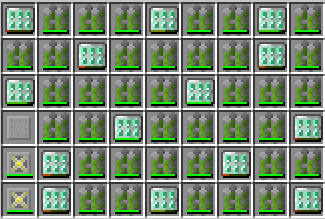
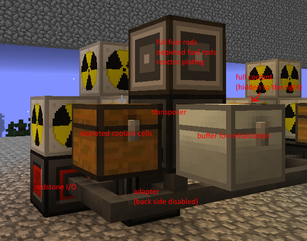
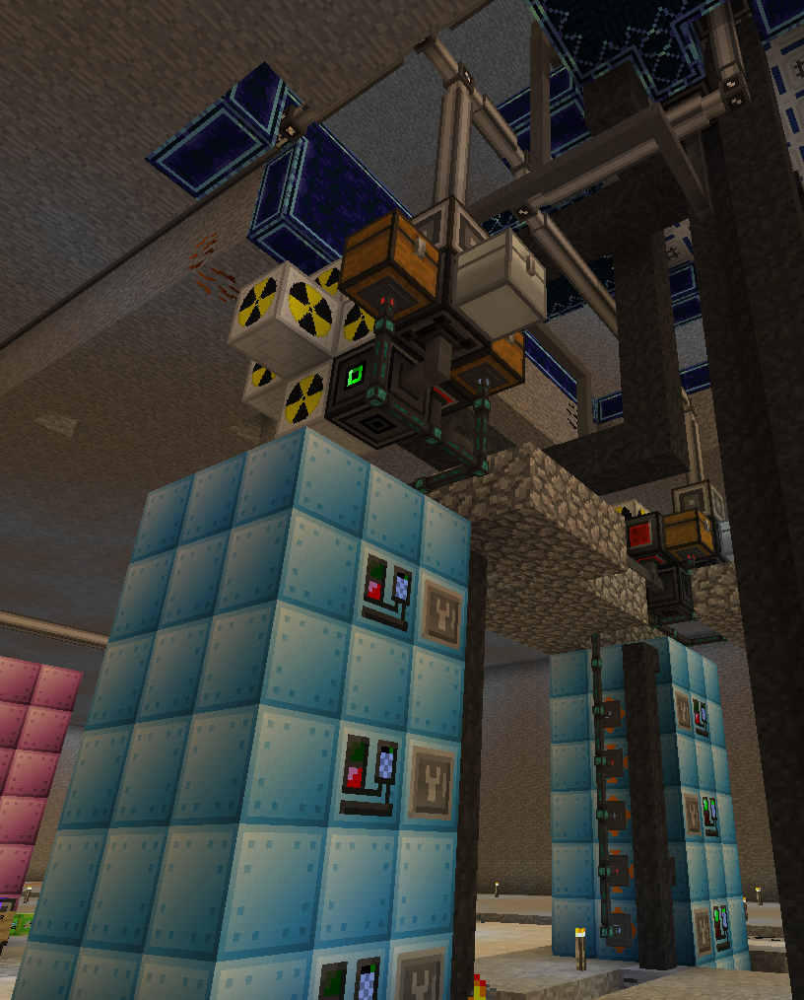
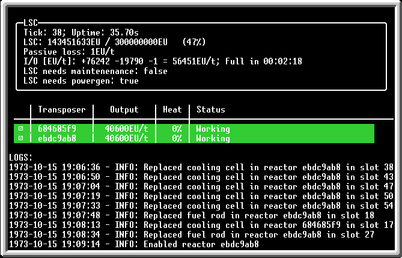
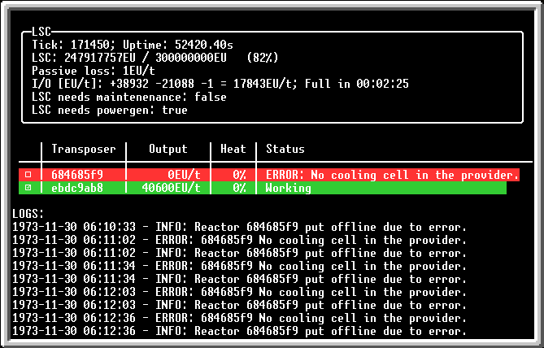

# GTNH Vacuum Reactor Controller

This an OpenComputers script for handling multiple [IC2 Vacuum Reactors](https://gtnh.miraheze.org/wiki/Vacuum_Reactors) in GTNH.

## Usage

### Installation

Just copy the file `vacuum_reactors.lua` anywhere on the drive (make sure it's on the correct computer/server). Can be run directly from the command line without any arguments.

### Config setup

You must specify the reactor configuration in the code - the program automatically fills and maintains the reactor chamber. There is one shared configuration for all reactors. It is controlled by a 2d array `REACTOR_PATTERN`. `C` stands for coolant, `R` stands for fuel rod, `U` stands for "unknown". The "unknown" designation can be used for components other than coolant/rods that should not be touched by the program ever. You WILL NOT be using pure rod+coolant reactors due to some limitations (don't blame me, blame ic2) which will be described later in this document. You should always add some components to cool the reactor hull a little bit.

Default reactor chamber config:

Aside from that you can modify the following constants:

`LSC_HYSTERESIS_MIN = 0.5` - the LSC power threshold at which energy generation will be allowed

`LSC_HYSTERESIS_MAX = 0.95` - the LSC power threshold at which energy generation will be halted

`COOLING_CELL_DEPLETED_THRESHOLD = 0.95` - the % of a coolant cell that has to be used in order for the program to recognize it as depleted. It should be modified for cells smaller than 360k. It is ill-advised to run with cells smaller than 360k.

`MAX_REACTOR_OPERATING_HEAT_PCT = 0.5` - the reactor chamber heat threshold at which the reactor will be automatically disabled. No real reason to change it, unless you're trying out MOX stuff (which you shouldn't with the current script).

Modifying other constants is ill-advised and should only be done by advanced users.

### Reactor setup

Each reactor requires the following components to be connected to it:

- Transposer
- Adapter (make sure the adapter only connects to the reactor with 1 side, otherwise the reactor will be seen multiple times in the script and the initialization will fail. You can disable an opposite face on an adapter with shift+rightclick with a wrench)
- Redstone I/O

The transposer must have 4 inventories connected to it:

- normal minecraft chest for depleted coolant cells (must either be empty or contain depleted coolant cells to be identified correclty)
- normal minecraft chest for full coolant cells (must contain at least one full coolant cell to be identified correctly)
- iron chest for temporary buffer (either this must be empty or the reactor must be empty, as the contents are exchanged between them)
- ME interface for full fuel rods (you can use it to provide a specific amount. 2-3 should be enough, should be refilled fast enough), depleted fuel rods, and a single reactor plating (used during initialization) (must be the full-block variant, because otherwise OC can't read the inventory :( )

Example ME interface setup:

Provides new fuel, single reactor plating; takes away depleted fuel.

Example reactor chamber setup:

NOTE: the Redstone I/O has one side disabled (with a wrench) such that only one side connects to the reactor. Otherwise initialization verification will fail as there is no way to ensure that both faces that the Redstone I/O touches belong to the same reactor.

The only time you should touch the reactor chamber is to place the components that the script won't touch (reactor platings, heat vents). The fuel rods should be provided by the ME Interface, and coolant cells by one of the minecraft chests. The program automatically fills the reactor before turning it on based on the configuration specified in the code.

Example double reactor setup with vacuum freezers:

[gtnh-flow](https://github.com/OrderedSet86/gtnh-flow) diagram for a single reactor with the default chamber setup:

### UI

Clicking on a line corresponding to a reactor will toggle it (if disabled like this it will never be turned on by the program).

Ctrl+C shuts down the program gracefully.

UI with an LSC and 2 reactors:

Reactors are identified by the transposer they are connected to, as this is how they are easiest to identify in the world. Only the first 8 charactes of the UUID are printed for clarity.

## Requirements and recommendations

### Hardware

While the program can be ran using a computer it is highly advised to use a server for more components for future expansion. It requires ~10 components to run a single reactor, and 3 additional components for each subsequent one. Do not forget to reboot the server after modifying the attached components.

Recommended hardware specification:
- Tier 3 CPU
- 2x Tier 2 RAM
- Tier 1 HDD
- Tier 2 GPU
- Tier 2 screen (currently the resolution is forced to 80x25)

Optional hardware:
- Component busses for expansion

The program may run on lesser hardware but it is untested.

### Software

Required software/OS:
- EEPROM with Lua BIOS
- OpenOS

### Config

It is **HIGHLY** recommended to change the yield timeout in the config from 5 to a higher number (for example a few hundred). It can be found in the file config/OpenComputers.cfg, in section "computer", property "timeout". If a single in-game tick takes longer than this timeout then the computer WILL hard crash, the redstone signals from redstone I/O WILL persist, and the reactor WILL blow up eventually due to lack of maintanence while still being on.

## Limitations

### Inability to handle hard crashes

If the computer hard crashes (for example due to "Too long without yielding" error) we can't do anything. The reactors will likely blow up in such case. See the "Config" section in this readme.

### Processing time

Checking reactor heat, lsc status, and transferring items are direct calls, which means they block for 1 tick, which limits how fast the processing can be done. This limits the number of reactors that can be handled by a single computer and why some throttling on this calls is done. This is why at least 360k coolants are recommended, as they allow more leeway in the timing. With all this in mind, the program should still handle a reasonable number of reactors properly.

### Trickling heat

While replacing a coolant cell takes a single minecraft tick it is still possible in some cases that the reactor will perform its tick in this very moment the coolant is not present. (trust me, I tried mitigating this, but even adding very specfic waits was either not enough or would disable the reactor for unreasonable amount of time, due to how wonky redstone control is). This means that pure vacuum reactor setups cannot be used. You must always include some form of hull cooling. One or two overclocked heat vents should be enough, just don't put them next to fuel rods.

## Principle of operation

The program has 3 stages. Config stage, initialization stage, and operation stage. They are described below.

### Config stage

The configurability is minimal, but includes one very important thing. The reactor configuration itself is specified within the code (see "Usage" section), and is used later by the program to know where to place the components and ensure everything is is order.

### Initialization stage

In this stage the program find all attached transposer, redstone I/O, gt_machine (connected through an adapter), and reactor chamber (connected through adapters) components. The gt_machine is expected and verified to be the LSC (Lapotronic Supercapacitor). In the current state the existence of a well formed LSC is required for proper operation (otherwise the reactors will be kept off). It is used to determined whether there is need for any power to be generated. Only a single LSC is allowed.

Transposers have the inventories on their sides identified based on their type and contents.

- reactor chamber based on type
- buffer chest based on type (iron chest)
- chest for full coolant based on type (minecraft chest) and content (must have at least one full coolant)
- chest for depleted coolant based on type (minecraft chest) and content (must either be empty or contain depleted coolant)

After the components are listed the program attempts automatic identification of reactor setups (which components correspond to which reactor). The user does not need to specify the addresses of any component. All components are identified and assigned automatically. If any component cannot be assigned the initialization fails and the program exits. The assignment is performed through the following procedure:

1. All reactors are ensured to be off
2. All reactors have their contents dumped into the buffer chest (the iron chest connected to the transposer)
3. For each redstone I/O:
    1. Turn it on
    2. Wait a second for the reactor to tick
    3. Find the reactor that's running and assign it to the redstone I/O
    4. Turn it off
4. For each transposer
    1. Move a reactor plating from the ME interface (connected to the transposer, must be in its inventory)
    2. Wait a second for the reactor to tick
    3. Find the reactor with higher heat capacity and assign the transposer to it
    4. Move the reactor plating back to the ME interface

Lastly, widgets are created, and initial information about the LSC and the reactors is gathered.

### Operation stage

In this stage the dashboard, the LSC, and the reactors, are all handled in an infinite loop.

First, the LSC is handled. The sensor information is requested and parsed. This is throttled to be done once every few iterations as it's not critical. It is determined if any power generation needs to take place. Note, that all steps run regardless of whether power generation is required or not, just the reactor will not turn on if there is no need.

Second, all reactors are handled. Each reactor is processed sequentially (i.e. no interleaving of individual sub-steps):

Reactor heat is updated, but not in all iterations, so there may be even a few seconds of delay with many reactors (it is expected that they can't blow up in a few ticks without any cooling).

Reactor's inventory is queried (once). It will be inspected multiple times later for different steps.

Verification happens whether the reactor is in operating conditions. That is, whether its components match the predefined configuration and whether the heat is not too high (below 50% by default). If any problem is found at this stage the reactor will disabled, but attempts will be allowed to remedy this later.

Reactor's inventory is inspected for missing or depleted coolant. By default coolant is considered depleted at <=5% heat capacity remaining, but it SHOULD be changed in the config for coolant smaller than 180k. It is however not advised to run coolant smaller than 360k anyway. Only 8 (by default) coolants are processed per reactor in each tick (this is done to prevent updating one reactor take too much time and leaving others unmaintaned).

Reactor's inventory is inspected for missing or depleted fuel rods. Only one fuel rod is processed per reactor per each tick (it's not critical to replace, and we don't want to waste time on this).

Thirdly, the dashboard is rendered. This is done every other tick, but is not very intensive.

### Safety mechanisms

The whole operation stage is run through a pcall, and any error is captured and all reactors turned off. So if any exception/error is thrown it's fine, the reactors will be turned off.

If a reactor reaches >50% heat it will be disabled.

If a reactor has incorrect inventory configuration it will be disabled.

If full coolant/rod is missing, or there is no space to put depleted coolant/rod, the reactor will be disabled and will have to be manually restarted (see "UI" section).

Example state after vacuum freezers for one reactor failed to provide coolant:

If the computer running this program has less than 50% of the energy buffer full the program will shut down gracefully, while ensuring all reactors are disabled.

## Future directions

### MOX

It would be nice to support MOX vacuum reactors, however due to issues outlined in the section about limitations it's unclear how to handle them. For sure the initialization would ramp up the heat using a specific chamber setup starting from 0 heat. For the maintanence there are two options:

1. Completely shut the reactor down when exchanging a coolant cell. From my experiments even this can be wonky though, and due to how redstone control works the delays would need to be quite long (multiple ticks before and after exchange). Though this might be fine with large coolants.
2. When exchanging coolant first remove all neighbouring fuel cells. This would be fool-proof, if timing allows. Would also result in minimal power losses.

### Detailed overview

A detailed overview for each reactor (on click), possibly with statistics and simulations.

### Other forms of external control

Currently LSC is a mandatory part, but in the future setups without it should be allowed. In such case the master switch should be some kinda of redstone input instead of the LSC power readings. Currently compatibility with NIDAS is unclear.

### Real-time logs

Currently logs use in-game time. Ideally they should use real-time.
